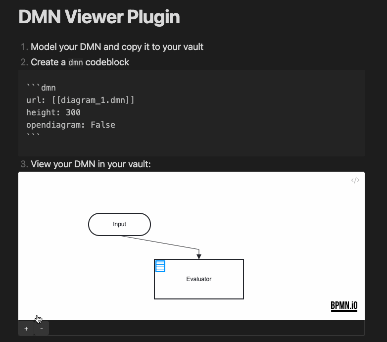

# DMN-Plugin for Obsidian [](https://github.com/joleaf/obsidian-dmn-plugin/releases) [](https://github.com/joleaf/obsidian-dmn-plugin/actions/workflows/release.yml) [](https://obsidian.md/plugins?id=dmn-plugin)

This plugin lets you view DMN diagrams interactively in your [Obsidian](https://www.obsidian.md) notes with a
`dmn` code-block.
Furthermore, a DMN modeler lets you edit your DMNs directly in Obsidian.
The plugin is based on the [dmn-js](https://github.com/bpmn-io/dmn-js) library.
If you want to evaluate/execute your DMNs inside your note, look at
the [DMN Eval Plugin](https://github.com/joleaf/obsidian-dmn-eval-plugin).

## How to use (CodeBlock)

1. Add a valid `*.dmn` file to your vault (e.g., `my-diagram.dmn`, modeled with
   the [Camunda Modeler](https://camunda.com/de/download/modeler/))
2. Add the DMN to your note:

````
```dmn
url: [[my-diagram.dmn]]
```
````

### Parameter

You can customize the view with the following parameters:

| Parameter            | Description                                                | Values                                                   |
|----------------------|------------------------------------------------------------|----------------------------------------------------------|
| url                  | The url of the *.dmn file (required).                      | Relative/Absolute path, or `[[*.dmn]]` as markdown link. |
| decisionid           | An ID of a decision table to open (if empty open the DRD). | String value                                             |
| height               | The height of the rendered canvas.                         | [200..1000]                                              |
| opendiagram          | Show a link to the *.dmn file.                             | True/False                                               |
| showzoom             | Show the zoom buttons below the canvas.                    | True/False                                               |
| enablepanzoom        | Enable pan and zoom.                                       | True/False                                               |
| zoom                 | Set the zoom level. Default is 'fit-viewport'.             | 0.0 - 10.0                                               |
| x                    | Set the x coordinate, if a zoom value is set.              | 0 - ... (default: 0)                                     |
| y                    | Set the y coordinate, if a zoom value is set.              | 0 - ... (default: 0)                                     |
| forcewhitebackground | Force a white background.                                  | True/False                                               |

While typing inside a `dmn` code block, Obsidian autocompletes the parameter names (with a short value hint and the full description on hover).

### Insert / Edit code block from a popup

You don't have to type the code block manually:

1. Open a markdown note and put the cursor where the diagram should be inserted (or inside an existing `dmn` code block to edit it)
2. Run the command **"Insert / Edit DMN code block"** from the command palette (it is only enabled while a markdown file is active)
3. Pick the file with **Browse...** (all `*.dmn` files of the vault are listed), set the decision table to open (optional) and adjust the other parameters
4. Click **Insert** — the code block is created at the cursor position (or the block the cursor was in gets replaced)

### Create a new DMN

The command **"Create DMN"** creates a new `*.dmn` file (in the folder of the active file) and opens it in the DMN modeler.
The **New DMN** ribbon icon does the same.

### Embed a DMN

You can also embed a DMN directly with a markdown embed:

````
![[my-diagram.dmn]]
````

The embedding uses the default values from the plugin settings.

### Example



## How to edit the DMN

Just open the DMN file in your obsidian vault and the DMN will be editable in fullscreen mode.
The modeler shows the full DMN (the DRD view with all decisions) and lets you open and edit every decision table, literal expression, and boxed expression.

### Features

- Edit decision tables, literal expressions, and boxed expressions
- Undo/Redo
- Export SVG
- Minimap and grid (toggleable in the plugin settings)

## Install

### .. automatically in Obsidian

1. Go to **Community Plugins** in your Obsidian Settings and **disable** Safe Mode
2. Click on **Browse** and search for "[DMN](obsidian://show-plugin?id=dmn-plugin)"
3. Click install
4. Toggle the plugin on in the **Community Plugins** tab

### .. manually from this repo

1. Download the latest [release](https://github.com/joleaf/obsidian-dmn-plugin/releases) `*.zip` file.
2. Unpack the zip in the `.obsidian/plugins` folder of your obsidian vault

## How to dev

1. Clone this repo into the plugin folder of a (non-productive) vault (`.obsidian/plugins/`)
2. `npm i`
3. `npm run dev`
4. Toggle the plugin on in the **Community Plugins** tab

## Donate

<a href='https://ko-fi.com/joleaf' target='_blank'>
